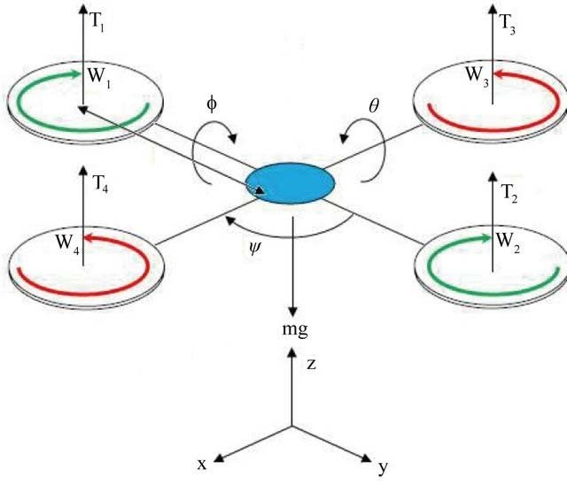
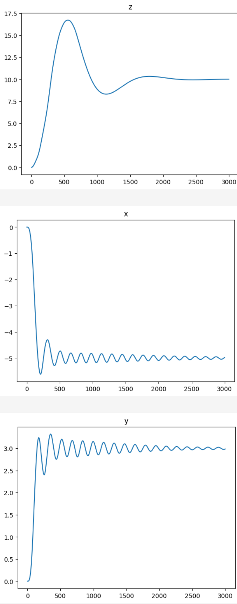
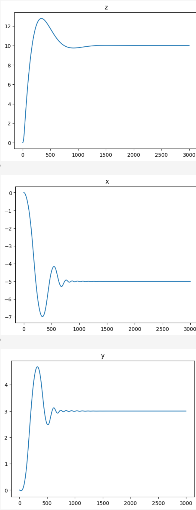
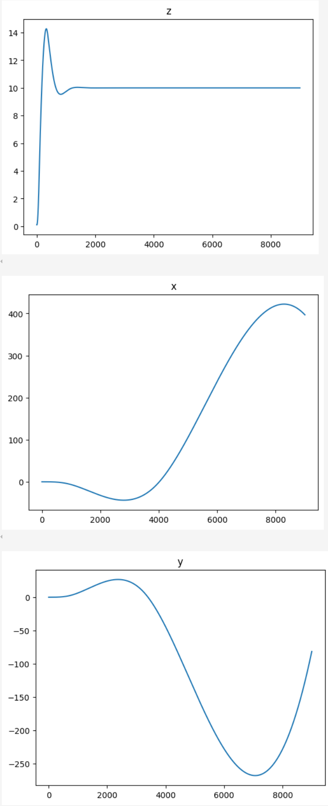
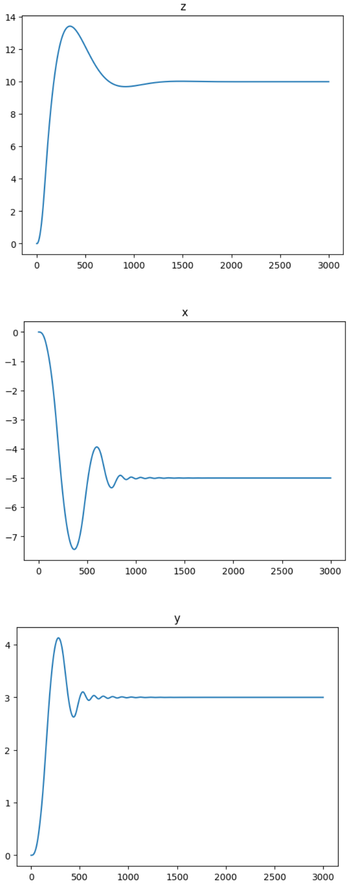

# Comparative Analysis of Quadcopter Simulation Frameworks: A Study of Crazyflie Dynamics Implementation in Rust

## Abstract

This study presents a comparative analysis of quadcopter simulation implementations across multiple physics engines, with particular emphasis on Rust-based solutions. The research focuses on simulating the dynamics of a Crazyflie quadcopter, a 27-gram micro unmanned aerial vehicle (UAV), utilizing proportional-integral-derivative (PID) control systems for autonomous navigation to specified coordinates.

## 1. Introduction

The accurate simulation of quadcopter dynamics represents a critical component in the development and validation of autonomous flight control systems. This investigation examines the efficacy of various physics simulation frameworks for modeling aerial vehicle dynamics, with a specific focus on evaluating Rust-based implementations against established reference standards.

The Crazyflie quadcopter serves as the experimental platform due to its well-documented specifications and widespread adoption in research applications. The vehicle's compact form factor and established control characteristics provide an ideal test case for comparative simulation analysis.

## 2. Methodology

### 2.1 Mathematical Framework

The quadcopter dynamics are modeled using a material point abstraction with four discrete thrust sources generating external forces at each simulation timestep. Each propulsive force contributes to:
- Linear accelerations in the x-y plane
- Rotational torques about the x and y axes
- Aerodynamically-derived torques about the z-axis



The simulation framework abstracts the underlying mathematical models through the application of external forces and torques to rigid body entities, enabling direct comparison across different physics engines. The differential equations for the reference implementation model the drone as a material point:


### 2.2 Control System Architecture

A standard PID controller operates at 60Hz frequency to maintain consistency across all simulation platforms. The controller parameters are derived from the Unified Robot Description Format (URDF) specifications, ensuring identical dynamic characteristics across implementations.

### 2.3 Experimental Design

The investigation encompasses four distinct simulation implementations:
1. **Reference Implementation (MuJoCo)**: Established baseline using industry-standard physics simulation
2. **Reference Implementation (Genesis)**: Alternative reference platform for validation
3. **Rust Implementation (Rapier)**: Primary Rust-based physics engine evaluation
4. **Rust Implementation (Custom Dynamics)**: Direct mathematical model integration

## 3. Implementation Details

### 3.1 MuJoCo Reference Implementation

The MuJoCo implementation utilizes a comprehensive [URDF model](assets/cf2_mujoco/cf2.xml) imported directly into the simulation environment. Physical parameters including mass distribution, inertial properties, and geometric constraints are extracted automatically from the model specification. The complete implementation is documented in the [MuJoCo Jupyter notebook](uav_control-crazyflow.ipynb).



### 3.2 Genesis Reference Implementation

The Genesis platform provides an alternative reference implementation, demonstrating reduced oscillatory behavior and improved convergence characteristics compared to the MuJoCo baseline. The implementation details are available in the [Genesis Jupyter notebook](uav_control-genesis-sim.ipynb).



### 3.3 Rapier Physics Engine Implementation

The Rapier implementation leverages the [rapier3d-urdf](https://crates.io/crates/rapier3d-urdf) crate for automated model importation. Rotor dynamics are simplified to instantaneous force sources, eliminating potential aperiodic control loop interactions. The implementation applies external forces and torques at each simulation step according to the following dynamics model. The complete implementation is available in the [Rapier Jupyter notebook](uav_control-rapier.ipynb) and the [Rapier simulation source code](https://github.com/stillonearth/bevy_urdf/blob/aerial/examples/quadrotor_rapier_rest.rs).

```rust
fn drone_dynamics(&self, drone_center_body: &mut RigidBody, thrusts: [f32; 4]) {
    let torque_to_thrust_ratio = 7.94e-12 / 3.16e-10;
    
    drone_center_body.reset_forces(false);
    drone_center_body.reset_torques(false);
    
    let rotation = drone_center_body.rotation().clone();
    
    // Rotor position vectors relative to center of mass
    let rotor_positions = [
        vector![0.028, -0.028, 0.0],
        vector![-0.028, -0.028, 0.0], 
        vector![-0.028, 0.028, 0.0],
        vector![0.028, 0.028, 0.0]
    ];
    
    // Calculate thrust forces and resulting torques
    let thrust_vector = vector![0.0, 0.0, 1.0];
    let individual_forces: Vec<_> = thrusts.iter()
        .map(|&thrust| thrust_vector * thrust)
        .collect();
    
    let total_force = rotation * individual_forces.iter().sum();
    drone_center_body.add_force(total_force, false);
    
    // Calculate and apply torques from thrust asymmetries
    let thrust_torques: Vec<_> = rotor_positions.iter()
        .zip(individual_forces.iter())
        .map(|(pos, force)| pos.cross(force))
        .collect();
        
    let aerodynamic_torques: Vec<_> = individual_forces.iter()
        .map(|force| torque_to_thrust_ratio * force)
        .collect();
    
    let net_thrust_torque = rotation * thrust_torques.iter().sum();
    let net_aerodynamic_torque = rotation * (
        (aerodynamic_torques[0] - aerodynamic_torques[3]) - 
        (aerodynamic_torques[1] - aerodynamic_torques[2])
    );
    
    drone_center_body.add_torque(net_thrust_torque - net_aerodynamic_torque, true);
}
```

The [Rust quadcopter dynamic model](examples/quadrotor_rapier_rest.rs) is implemented as a REST service to maintain compatibility with the Python controller utilized in the reference experiments.



### 3.4 Custom Dynamics Implementation

A direct mathematical integration approach was implemented to provide an additional comparison point, utilizing explicit differential equation solving methods identical to the Genesis reference implementation. The implementation details are documented in the [custom dynamics Jupyter notebook](uav_control-genesis-sim.ipynb).



## 4. Experimental Results

### 4.1 Reference Implementation Performance

Both MuJoCo and Genesis reference implementations demonstrated stable control characteristics with acceptable convergence properties. The Genesis implementation exhibited superior damping characteristics with reduced oscillatory behavior during transient responses.

### 4.2 Rust Implementation Analysis

#### 4.2.1 Rapier Physics Engine Results

The Rapier implementation demonstrated significant deviations from reference behavior, particularly in lateral control authority. Observed phenomena include:
- Progressive overshoot amplification in x and y axis control
- Degraded stability margins compared to reference implementations
- Inconsistent damping characteristics across control axes

#### 4.2.2 Custom Dynamics Implementation Results

The direct mathematical integration approach achieved behavior closely matching the Genesis reference implementation, validating the underlying mathematical model accuracy.

## 5. Discussion

### 5.1 Performance Comparison

The experimental results reveal substantial variations in simulation fidelity across different physics engine implementations. While reference implementations (MuJoCo and Genesis) demonstrate consistent and predictable behavior, the Rust-based Rapier implementation exhibits concerning stability degradation.

### 5.2 Implementation Considerations

The observed discrepancies in the Rapier implementation may be attributed to several factors:
- Numerical integration scheme differences
- Timestep handling variations
- Constraint solving methodologies
- Force application timing and sequencing

### 5.3 Limitations

Several limitations constrain the scope of this analysis:
- Fixed simulation frequency limitations in certain implementations
- Simplified rotor dynamics modeling
- Limited parameter sensitivity analysis
- Absence of external disturbance modeling

## 6. Conclusions

This comparative study demonstrates significant variations in quadcopter simulation fidelity across different physics engine implementations. While Rust-based custom dynamics integration achieves reference-quality performance, established physics engines such as Rapier require additional investigation and potential modification to achieve acceptable simulation accuracy for aerial vehicle applications.

### 6.1 Key Findings

1. **Reference Implementation Consistency**: MuJoCo and Genesis provide reliable baseline performance with minor variations in damping characteristics
2. **Rust Implementation Viability**: Custom dynamics integration demonstrates the feasibility of high-fidelity Rust-based simulation
3. **Physics Engine Limitations**: FOSS-Rust physics engines may require domain-specific modifications for aerial vehicle simulation applications

### 6.2 Future Work

Recommended directions for continued research include:
- Comprehensive parameter sensitivity analysis across all implementations
- Investigation of alternative Rust physics engines (e.g., Avian)
- Development of standardized aerial vehicle simulation benchmarks
- Integration of more sophisticated rotor dynamics models
