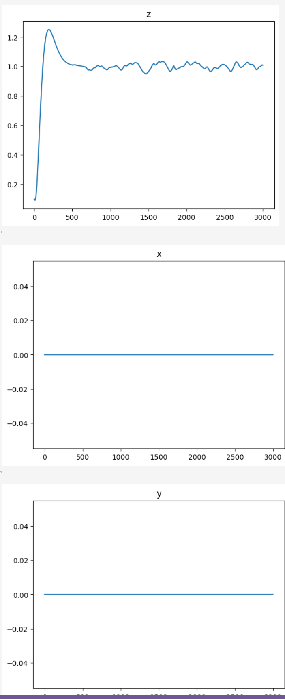
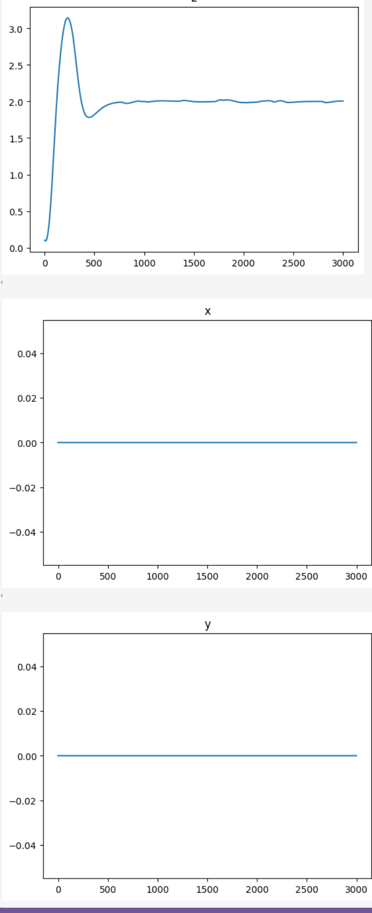

# Simulating Crazyflie Quadcopter wtih Rust

## Project Description

Rust should be a good choice for physical simulations and it feels like a solid choice for it. My experiment would be simulating a crazyflie quadcopter, a 27-g microdrone and controlling it with a PID controller that should direct it to desired coordinates.

Quadcopter should be relatively easy to simulate as a material point with 4 sources of thrust modelled as external forces at each timestep. Each force will then create a x-y torque and also a z torque that is derived from aerodynamical properties of a rotor.

I would start with debugging a controller with a known reference implementation of drone dynamics moddeld with mujoco, validate it on another implementaion.

## Project Goals

* Investigate rust physical engines for aerial simulations
* Find the best one

## Mathematical Models


In framework of physical engines I would only apply external forces and torques to a body, abstracing away underlying mathermatical model. Differential equations for a reference implementation model drone as a material point:


## Results

### Reference Implementation: MuJoCo

[Jupyter](uav_control-crazyflow.ipynb)

MuJoCo allows to import a drone from [URDF](assets/cf2_mujoco/cf2.xml). Every subsequent implementation uses paramters from urdf, so dynamics of modelled copter should be identical*.

A typical drone controller should run on 100Hz frequency, but in this case frequency is set to 60hz, in order to compare it with physical engines running in bevy engine.


## Reference Implementation: Genesis

[Jupyter](uav_control-genesis-sim.ipynb)


Genesis exhibits less oscilations and drones gets to equilibrium quickly.

## Rust Implementation: Rapier

[Jupyter](uav_control-rapier.ipynb)
[Rapier Simulation](https://github.com/stillonearth/bevy_urdf/blob/aerial/examples/quadrotor_rapier_rest.rs)

Rapier has [rapier-urdf](https://crates.io/crates/rapier3d-urdf) for importing robotic models, however it won't model rotors. First-iteration implemention in Rust would model rotors as instantaneous force source, without introcucing aperiodic link into control.

Drone dynamics is applied at each simulation step as an external force and torque, where parameters are extrated from urdf and hard-coded. Physical parameters of rigid body are extarcted from urdf by rapier-urdf, and modelled as a material point with defined inertia matrix and mass.

```rust
    fn drone_dynamics(&self, drone_center_body: &mut RigidBody, thrusts: [f32; 4]) {
        let torque_to_thrust_ratio = 7.94e-12 / 3.16e-10;

        drone_center_body.reset_forces(false);
        drone_center_body.reset_torques(false);

        let rotation = drone_center_body.rotation().clone();

        let rotor_1_position = vector![0.028, -0.028, 0.0];
        let rotor_2_position = vector![-0.028, -0.028, 0.0];
        let rotor_3_position = vector![-0.028, 0.028, 0.0];
        let rotor_4_position = vector![0.028, 0.028, 0.0];

        let f = vector![0.0, 0.0, 1.0];
        let f1 = f * thrusts[0];
        let f2 = f * thrusts[1];
        let f3 = f * thrusts[2];
        let f4 = f * thrusts[3];

        let full_force = rotation * (f1 + f2 + f3 + f4);

        drone_center_body.add_force(full_force, false);

        let t1_thrust = (rotor_1_position).cross(&(f1));
        let t1_torque = torque_to_thrust_ratio * (f1);

        let t2_thrust = (rotor_2_position).cross(&(f2));
        let t2_torque = torque_to_thrust_ratio * (f2);

        let t3_thrust = (rotor_3_position).cross(&(f3));
        let t3_torque = torque_to_thrust_ratio * (f3);

        let t4_thrust = (rotor_4_position).cross(&(f4));
        let t4_torque = torque_to_thrust_ratio * (f4);

        let t_thrust = rotation * (t1_thrust + t2_thrust + t3_thrust + t4_thrust);
        let t_torque = rotation * ((t1_torque - t4_torque) - (t2_torque - t3_torque));

        drone_center_body.add_torque(t_thrust - t_torque, true);
    }
```

[rust quadcopter dynamic model](examples/quadrotor_rapier_rest.rs) is implemented as a rest-service to be compatible with python controller used in reference experiments.


Rapier would not exhibit the same behaviour as MuJoCo and Genesis on alteral control, showing significant increaseing overshoot on x and y axis.

**Review: simulation should be corrent, can't find issue here**

## Bonus: Rust Implementation: Avian: Altitude Control

[Jupyter](uav_control-avian-sim.ipynb)
[Rapier Simulation](https://github.com/stillonearth/bevy_urdf/blob/aerial/examples/quadrotor_avian.rs)

The next candidate is bevy plugin avian, that has similar semantics to bevy_rapier. Not that previos example used pure rapier.

The first iteration in tuning a controller and implementing a quadcopter model would be altitude control. i.e. get drone to to lift off and hold a stable altitude.

A drone is modelled as material point with mass=27g inertial properties of a cyllinder of r = 6cm and h = 2.5 cm. The center of mass is defined at (0, 0, 0) as in case with URDF. Setting diagonal matrix from URDF gets drone position to inf on all 3 axis so in this implementation it's dropped.

```rust
fn spawn_quadcopter(
    commands: &mut Commands,
    meshes: &mut ResMut<Assets<Mesh>>,
    materials: &mut ResMut<Assets<StandardMaterial>>,
    asset_server: &Res<AssetServer>,
    q_quadcopter: Query<(Entity, &Quadcopter)>,
) {
    for (entity, _) in q_quadcopter.iter() {
        commands.entity(entity).despawn();
    }

    commands
        .spawn((
            RigidBody::Dynamic,
            Mass(0.027),
            Collider::cylinder(0.06, 0.025),
            Mesh3d(meshes.add(Cylinder::new(0.06, 0.025))),
            MeshMaterial3d(materials.add(Color::linear_rgba(1.0, 0.2, 0.3, 0.5))),
            Transform::from_xyz(0.0, 0.1, 0.0),
            Name::new("Quadcopter"),
            ExternalForce::new(Vec3::ZERO).with_persistence(false),
            ExternalTorque::new(Vec3::ZERO).with_persistence(false),
            CenterOfMass::new(0.0, 0.0, 0.0),
            Friction::new(1.0),
            // AngularInertia::new(Vec3::new(1. / 1.4e-5, 1. / 2.17e-15, 1. / 1.4e-5)),
            Quadcopter,
            NoAutoMass,
            NoAutoCenterOfMass,
        ))
        .with_children(|spawner| {
            spawner.spawn((
                Mesh3d(asset_server.load("quadrotors/crazyflie/body.obj")),
                MeshMaterial3d(materials.add(Color::srgb(0.3, 0.4, 0.3))),
                Transform::IDENTITY
                    .with_rotation(Quat::from_rotation_x(-std::f32::consts::FRAC_PI_2)),
            ));
        });
}
```

Drone dynamics is ported from rapier with little change so it should behave identically.

```rust
fn quadcopter_dynamics(
    mut er_motor_thrusts: EventReader<ControlMotors>,
    mut q_quadcopter: Query<(
        Entity,
        &mut ExternalForce,
        &mut ExternalTorque,
        &Transform,
        &Quadcopter,
    )>,
) {
    for event in er_motor_thrusts.read() {
        for (_, mut external_force, mut external_torque, drone_transform, _) in
            q_quadcopter.iter_mut()
        {
            let torque_to_thrust_ratio = 7.94e-12 / 3.16e-10;

            let rotation = drone_transform.rotation.clone();

            let rotor_1_position = Vec3::new(0.028, 0.0, -0.028);
            let rotor_2_position = Vec3::new(-0.028, 0.0, -0.028);
            let rotor_3_position = Vec3::new(-0.028, 0.0, 0.028);
            let rotor_4_position = Vec3::new(0.028, 0.0, 0.028);

            let f = Vec3::new(0.0, 1.0, 0.0);
            let f1 = f * event.thrusts[0];
            let f2 = f * event.thrusts[1];
            let f3 = f * event.thrusts[2];
            let f4 = f * event.thrusts[3];

            let full_force = rotation * (f1 + f2 + f3 + f4);

            *external_force = ExternalForce::new(full_force).with_persistence(false);

            let t1_thrust = (rotor_1_position).cross(f1);
            let t1_torque = torque_to_thrust_ratio * (f1);

            let t2_thrust = (rotor_2_position).cross(f2);
            let t2_torque = torque_to_thrust_ratio * (f2);

            let t3_thrust = (rotor_3_position).cross(f3);
            let t3_torque = torque_to_thrust_ratio * (f3);

            let t4_thrust = (rotor_4_position).cross(f4);
            let t4_torque = torque_to_thrust_ratio * (f4);

            let t_thrust = rotation * (t1_thrust + t2_thrust + t3_thrust + t4_thrust);
            let t_torque = rotation * ((t1_torque - t4_torque) - (t2_torque - t3_torque));

            *external_torque = ExternalTorque::new(t_thrust - t_torque).with_persistence(false);
        }
    }
}
```

Quadcopter is contolled via REST api provided by [bevy_rl](https://github.com/stillonearth/bevy_rl).

I had to adjust forces directed to rotors by 20% of their value. Q: why, drone has the same weight.

Altitude controller crashes as higher values oh h, and shows strange step-function for h=1, while it should be close to a sine-wave.

**h=1**



**h=2**



# Results

None of rust implementations show behaviour close to reference implementation. Reference implementations are not identical, but rapier impl has increasing inertia for x-y control. Avian impl should not be considered yet because it's locked on 60 fps, unless changed in impl.
